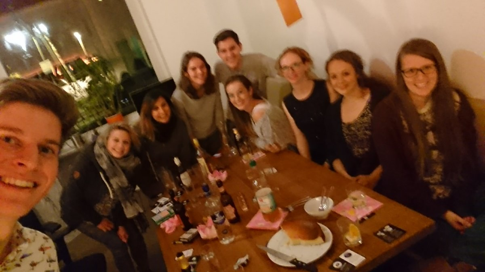

Es gibt viele Gründe, warum ich die webfactory so gerne meinen Arbeitgeber nenne. Einer davon ist unser Büro und die Tatsache, dass die Räumlichkeiten außerhalb der Arbeitszeiten von jedem Mitarbeiter auch privat genutzt werden können.

So kam es, dass ich am 13. Oktober schon zum dritten Mal bei “Rudirockt" bzw. in diesem Fall bei "Rudi rettet Reste” in unserem schönen Bistro servieren konnte.

Rudirockt wurde 2005 von vier Aachener Studenten konzipiert, um Studenten dabei zu helfen Kontakte zu knüpfen. Die Idee haben sie auf der Website [rudirockt.de](https://www.rudirockt.de/) umgesetzt, ein soziales Netzwerk für stadtübergreifende “running dinner”. Man meldet sich in Zweier-Teams an und muss nur noch die Adresse der Küche angeben. Einen Tag vor dem Event erhält man dann eine generierte “Route” zugeschickt, dort steht wo und bei wem man jeweils die Vor-, Haupt- und Nachspeise isst.

Man kann sich Rudirockt als soziales Drei-Gänge-Menü vorstellen: Bei jedem Gang kommen drei Teams (also sechs Personen) zusammen und die Gruppen variieren jedes Mal, sodass man an diesem Abend mit insgesamt zwölf verschiedenen Personen aus den anderen Teams gegessen haben wird.

Die webfactory bietet mit der reich ausgestatteten Küche und dem gemütlichen Bistro inklusive Tischkicker die optimale Location für ein solches Event.

Während ich bei den letzten beiden Events die Hauptspeise als Wunschgang angegeben habe, entschloss ich mich dieses Mal für die Nachspeise, denn diese hat den Vorteil, dass die Gäste nicht noch weiter zum nächsten Gang gehen müssen.

Zum Nachtisch haben wir Käsekuchen nach österreichischem Rezept und eine Cidre-Bowle serviert, während die Zitronen und Orangen für Letztere ganz nach dem Motto "Rudi rettet Reste" von Foodsharing kamen. Außerdem gab es noch veganen Vanillejoghurt mit selbstgemachter Erdbeermarmelade, da wir aus der Route entnehmen konnten, dass sich ein Gast vegan ernährt.

Bei interessanten Gesprächen und viel Lachen klingelte es plötzlich an der Tür. Vier Rudirocker sind auf das fröhliche Treiben im Bistro aufmerksam geworden und haben außerdem ein Team vom vorhergehenden Mittagessen durch die großen Fenster erspäht. Selbstverständlich lud ich sie ein, sich dazu zu gesellen und so vergrößerte sich unsere Runde.

Nachdem noch zwei Freunde meines Nachtischteams dazugestoßen sind, waren wir komplett und nach einem durstlöschendem Kartenspiel war auch die Cidre-Bowle längst ausgetrunken.

Mit diesem Blog-Beitrag möchte ich mich für die tollen Möglichkeiten bedanken, die mir die webfactory sowohl im Beruf, als auch in der Freizeitgestaltung bietet :-)

Rudirockt wurde 2013 bei “Land der Ideen” [ausgezeichnet](https://www.aachener-nachrichten.de/lokales/aachen/rudirockt-ausgezeichnet-bei-land-der-ideen_aid-32307239).

Dieser Beitrag wurde ursprünglich hier veröffentlicht: https://www.webfactory.de/blog/reste-retten-nach-feierabend-rudirockt-bei-der-webfactory