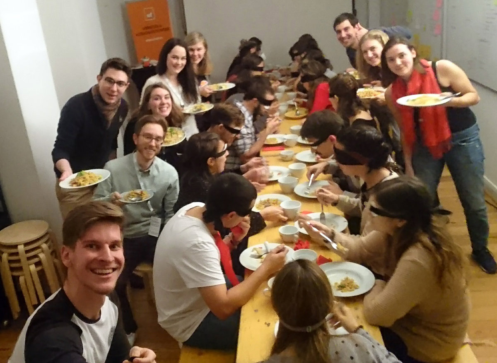

Seit diesem Jahr engagiere ich mich beim Erasmus Student Network (ESN) Bonn. Im Rahmen der Social Inclusion Days, welche vom 27. November bis 10. Dezember 2017 stattfinden, habe ich zusammen mit ESN Bonn ein „Dinner in the Dark“ veranstaltet.

Neben meiner Tätigkeit bei der webfactory engagiere ich mich auch beim Erasmus Student Network (ESN) Bonn. Im Rahmen der Social Inclusion Days, welche vom 27. November bis 10. Dezember 2017 stattfinden, habe ich zusammen mit ESN Bonn ein „Dinner in the Dark“ veranstaltet.

Die 21 Teilnehmerplätze für Erasmusstudierende in Bonn waren innerhalb von zwei Stunden nach Beginn der Anmeldung vergeben und wir freuten uns über das große Interesse.

Es galt ein Menü, Tische, Sitzplätze, Geschirr, Besteck und Augendbinden zu organisieren. 

Trotz des engen Zeitplans ist am Freitagabend alles bereit und das dreiköpfige Koch-Team bezieht um 17:30 Uhr die webfactory Küche, wo sie für den Rest des Abends kulinarische Genüsse zaubern. Ab 18 Uhr wird das webfactory Lab umgebaut und Augenbinden werden vorbereitet, bis kurz vor 19 Uhr schon die ersten Gäste eintreffen. Jeder Gast bekommt die Augen verbunden und wird daraufhin zu einem zufällig zugewiesenen Platz an der großen Tafel geführt. 

Als wir den ersten Gang, Feldsalat mit Feta, Granatapfel und Walnüssen, servieren, sind neue Bekanntschaften geschlossen und von oberflächlichen Gesprächen ist keine Spur. Oft wird eine leere Gabel zum Mund geführt, weswegen manche auf manuellere Methoden umsteigen. Für die Organisatoren bieten sich recht amüsante Szenen, zum Beispiel als wir den Teller einer Teilnehmerin entfernen, sodass sie mit Gabel und Löffel den Tisch nach ihrem Salat absucht.

Vor dem Hauptgang servieren wir den Gästen erst noch ein paar Gegenstände, die sie in Teams abtasten, um zu erkennen, worum es sich handelt.

Als Hauptspeise gibt es Nudeln mit Kirschtomaten und Weißweinsauce, welche eine willkommene Abwechslung von den schwer zu befördernden Salatblättern bieten.

Im Anschluss verwöhnt uns das Koch-Team mit einem Bratapfel-Schichtdessert, dessen Keksboden für besondere Verwirrung bei der Identifizierung sorgte.

Bei einem „Dinner in the Dark“ hat man nicht nur ein erhöhtes Geschmacksempfinden, sondern bekommt auch einen Eindruck davon, wie es ist, blind zu sein. Nachdem unsere Gäste die Augenbinden abnehmen dürfen, sagt mir eine Teilnehmerin, dass sie sich zu Hause unbedingt informieren müsse, wie blinde Menschen mit den Herausforderungen zurechtkommen, mit denen Sie sich in den vergangenen zwei Stunden zum ersten Mal konfrontiert sah.

Zum Abschluss zeigen wir zur Belustigung noch die Fotos und Videos des Abends auf der Leinwand.

Unsere Gäste und das ESN Bonn bedanken sich herzlich für die großzügige zur-Verfügung-Stellung der webfactory Räumlichkeiten!

Dieser Beitrag wurde ursprünglich hier veröffentlicht: https://www.webfactory.de/blog/erasmus-social-inclusion-days-dinner-in-the-dark