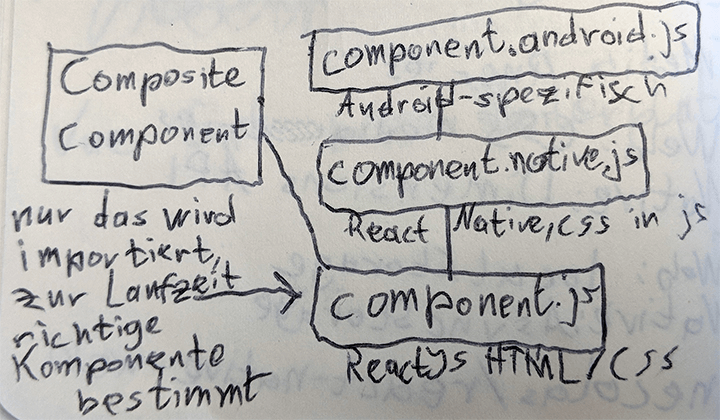
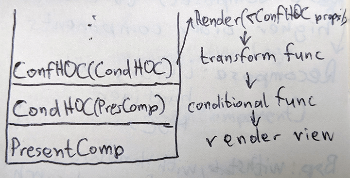
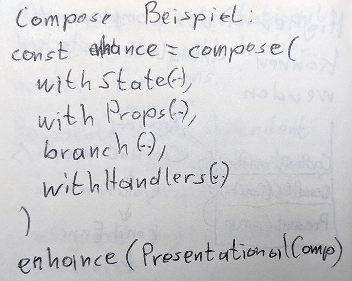

Dieses Jahr war ich zum zweiten Mal in Folge auf der enterJS-Konferenz in Darmstadt und fasse in diesem Beitrag einige der Talks zusammen, die ich besucht habe. Meine persönlichen Gedanken beschränke ich dabei lediglich auf kurze Kommentare, um in späteren Beiträgen genauer darauf einzugehen.

## Übersicht
* [Micro Frontends: JavaScript Integration Patterns](/posts/enterjs-darmstadt-2018-eine-zusammenfassung/#microfrontends)
* [No-Backend Peer to Peer Progressive Web Apps](/posts/enterjs-darmstadt-2018-eine-zusammenfassung/#no-backend-pwa)
* [Common Ways We Break Accessibility and How to Avoid Them](/posts/enterjs-darmstadt-2018-eine-zusammenfassung/#accessibility)
* [We need to talk about Preact](/posts/enterjs-darmstadt-2018-eine-zusammenfassung/#preact)
* [TensorFlow.js](/posts/enterjs-darmstadt-2018-eine-zusammenfassung/#tensorflowjs)
* [Cross-Plattform-Entwicklung mit React und React Native – Möglichkeiten und Stolpersteine](/posts/enterjs-darmstadt-2018-eine-zusammenfassung/#reactnative)
* [Unleash the Power of Higher-Order Components](/posts/enterjs-darmstadt-2018-eine-zusammenfassung/#hoc)
* [Einführung in D3.js – Mächtige Datenvisualisierung im Browser](/posts/enterjs-darmstadt-2018-eine-zusammenfassung/#d3js)

<h2 id="microfrontends">Micro Frontends: JavaScript Integration Patterns</h2>

von Nils Hartmann und Oliver Zeigermann

Nils und Oliver sind Serien-Speaker auf der enterJS. Sie beginnen den Talk mit der Behauptung, dass es genau drei Arten von Anwendungen gibt, die die bestmögliche Benutzererfahrung bieten:

Single-Page-Applications (SPA), mobile Apps und Desktop Apps. Auf die Frage, ob jemand aus dem Publikum nicht zustimmen würde, bleibt der Saal still.

Sie stellen drei Methoden/Architekturen für die Verbindung von Komponenten/Modulen im Frontend vor:

1. HTML-Links
2. Majestic Modular Monoliths
3. Micro Components

**Zu 1. HTML-Links**

Die Benutzer navigieren über echte HTML-Links zwischen Seiten. Dabei ist jede Seite eine eigene SPA und sie teilen untereinander keinen State.

Diese Architektur ist besonders für Entwickler sehr bequem, da die Module der einzelnen Teams komplett unabhängig voneinander sind. Leider ist das auch der Katalysator für eine inkonsistente und schlechte Benutzererfahrung.

Als Beispiel für diese Architektur nannten Hartmann und Zeigermann Outlook Web. Hier ist der Mail Client in React implementiert und auf der linken Seite befindet sich eine Navigation, um beispielsweise von Mails zum Kalender zu wechseln. Klickt man auf den Kalender, so öffnet sich eine komplett andere Webanwendung, welche auch kein React einsetzen muss. Die Navigation, um zurück zu der React-basierten Mail Anwendung zu kommen, ist dort weiterhin vorhanden, allerdings ein bisschen anders positioniert, was für ein inkonsistente Benutzeroberfläche sorgt.

**Zu 2. Majestic Modular Monoliths**

Bei einem Majestic Modular Monolith befinden sich mehrere Module auf einer Seite.

Bei der Entwicklung wird empfohlen, dass es pro Modul nur ein Team geben darf. Die Module können entweder in einem großen Repository, vorzugsweise getrennt durch die Ordnerstruktur, oder auch in individuellen npm Paketen verteilt werden.

Für Module, die nicht in die offen zugängliche npm-Registry veröffentlicht werden sollen, gibt es inhouse Lösungen wie nexus. Ein statischer Build setzt schließlich alle Module zu einer Anwendung zusammen.

Um für schnellere erste Interaktion zu sorgen, soll Lazy-Loading verwendet werden.

Der Nachteil an dieser Architektur ist, dass die Entwickler-Teams ihr Frontend-Framework nicht flexibel wählen können, wie beispielsweise bei HTML-Links.

Der Vorteil daran ist, dass generische Präsentationskomponenten, wie Buttons oder Listen, über die Teams hinweg geteilt werden können, um konsistentes Design zu erzielen. Auf diese Weise wird die beste Benutzererfahrung in SPAs erreicht.

Majestic Modular Monoliths brauchen fast immer zentrales State-Management mit Tools wie Redux.

Diese Architektur könnte sich beispielsweise für Google Docs eignen. Wenn sich der Cursor im Text des Dokuments in einer gefetteten Zeichenkette befindet, so muss sich auch die „Werkzeugleistenkomponente“ aktualisieren und den Button für fette Schrift grau hinterlegen.

**Zu 3. Micro Components**

Im Gegensatz zu MMMs werden die einzelnen Module erst zur Laufzeit miteinander verbunden.

Die Kommunikation zwischen Modulen findet über einen EventBus (Vorschlag: PostalJS) oder geteilten State statt.

Man gewinnt wieder die Freiheit bezüglich der Wahl der Frontend-Frameworks, allerdings neigen diese SPAs aus genau diesem Grund dazu, recht groß zu werden, da mehrere Frameworks eingebunden gleichzeitig verwendet werden, weshalb sie eher für Desktop Apps oder Intranets verwendet werden sollten.

Die aktuell einzige Möglichkeit, um unterschiedliche Micro Components komplett ohne Interferenzen zu integrieren, sind iframes. Alternativen sind div-Tags mit script-Tags und web components, welche aber nicht ganz frei von Nebeneffekten sind.

Ein Beispiel für eine Micro Frontend Architektur ist Spotify.
Kommentar

Bisher bin ich bei meinen React Apps, in welchen oft viele Komponenten denselben zentralen State manipulieren, auch gut mit EventHandlern über Props zurechtgekommen und habe Redux lediglich zu Testzwecken ausprobiert. Nils und Oliver haben offensichtlich schon viele Begegnungen mit komplexen Frontends gehabt und für mich war dieser Talk sehr spannend.

<h2 id="no-backend-pwa">No-Backend Peer to Peer Progressive Web Apps</h2>

von Felix Waterstraat und Sven Vowé (spreewunder GmbH)

**Use-Cases**
* offline-first Apps
* Apps, die zu vertrauliche Daten verarbeiten, um sie über einen Cloud Service kommunizieren zu lassen

**Architektur**

* Datenbank lokal im Browser mit PouchDB oder Minimongo, welche als Wrapper für IndexedDB und localStorage agieren.
* Datenbanksicherungen im Backend bei vorhandener Internetverbindung
* Peer to Peer Synchronisierung mit WebRTC
* RTCDataChannel zum teilen von Anwendungsdaten unter verschiedenen Browser-Instanzen

Das spreewunder Team kapselt diese Architektur in einem [Framework](https://spreewunder.com/#cloudless), welches sie „Cloudless“ getauft haben. Es scheint allerdings nicht quelloffen zu sein.

**Beispiel EKG-Messung**

Das Team der spreewunder GmbH hat einen EKG-Rekorder, nach einem gescheiterten Versuch mit Web USB, über Web Bluetooth an eine No-Backend PWA angebunden und empfängt davon ca. 40000 Datenpunkte pro Sekunde, was mit einer HTTP-Schnittstelle, im Vergleich zu jungen Web-APIs, noch viel größere Herausforderungen mitgebracht hätte. Kleinere Schwierigkeiten mit der Datendurchsatzrate konnten dabei durch das Deaktivieren des Bluetooth Low Energy Modus (BLE) und Verwendung von Bluetooth 5 gelöst werden.

Mit Hilfe von Vega, einem Wrapper für D3.js, werden die Live-Daten in einem Diagramm visualisiert.

**Kommentar**

Dieser Vortrag hat mich definitiv beeindruckt und auch inspiriert, mich noch tiefer mit PWAs auseinanderzusetzen. Besonders die „persistente“ Speicherung in IndexedDB werde ich auf die Probe stellen, nachdem ich letztes Jahr schon meine [alte Kalender Web-App](https://www.xkons.de/calendar/) mit der localForage-Library offline-fähig gemacht habe.

Ich finde es schade, dass Cloudless nicht quelloffen ist, da ich durch die Code-Beispiele zur Erstellung und Verwaltung von WebRTC-Verbindungen sehr neugierig geworden bin.

<h2 id="accessibility">Common Ways We Break Accessibility and How to Avoid Them</h2>

von Laura Carvajal @lc512k

Die erste Frage, die wir uns bei Accessbility stellen sollten ist, ob unsere Seite auch ohne eine Maus bedienbar ist.

* Gibt es focus styles?
	* niemals outline: none
	* in CSS4 kommt focus-visible für tab-spezifische Focus-Styles

* Sind alle Elemente durch „Tabben“ erreichbar und in einer sinnvollen Reihenfolge?
    * &lt;a> Tags ohne href-Attribut werden nicht angesteuert, benötigen tabindex=0

* Gibt es Inhalte, die von einem hover-Effekt abhängen?

Speziell für Screenreader ist es wichtig, dass alle &lt;h> Tags auf einer Seite auch dessen Hierarchie widerspiegeln. Als Beispiel wird ein Video gezeigt, in dem ein blinder Mann im Rahmen eines Accessibility-Audits des Digital Accessibility Centers versucht, per Screenreader zu der Hardware-Support Seite auf der Amazon-Hilfeseite zu gelangen, wobei Elemente, die sonst &lt;h2>-Elemente sein sollten, nämlich Unterkategorien für Hilfe (Bestellungen, Hardware, etc.), einfache Links waren. Aus diesem Grund, dauert es für den Besucher deutlich länger, zu der gewünschten Sektion zu navigieren.

H-Tags sollten auch nie zu Styling-Zwecken eingesetzt werden, sie dienen ausschließlich zur Repräsentation der Seitenstruktur!

Auf Seiten mit Video- oder Audioinhalten sind Untertitel einzubauen, welche keine Fehler enthalten und auch gut lesbar sind.

**Kommentar**

Ich freue mich immer auf Talks zu Accessibility, da ich bisher jedes Mal etwas neues gelernt und ein besseres Verständnis für die verschiedenen Herausforderungen von Menschen mit Behinderungen bei der Verwendung von Websites bekomme habe.

<h2 id="preact">We need to talk about Preact</h2>

von Sara Vieira @NikkitaFtw

Preact ist eine JavaScript Library, die von [Jason Miller](https://github.com/developit) begründet wurde, während er versuchte, die Innereien von Facebooks React zu verstehen. Heute steht eine große (19200 Sterne auf GitHub) und hilfsbereite Community dahinter und es wird von zahlreichen Firmen in Produktion eingesetzt (Uber, Lyft, Financial Times).

Sara nennt einige Punkte, in denen sich Preact von React unterscheidet:

* 4KB Gzipped vs 32KB React
* schneidet in Rendering-Benchmarks mehr als doppelt so schnell wie React ab
* preact-router wird im Gegensatz zu React Router vom selben Team maintained wie die Haupt-Library
* Standard-addEventListener für Event-Handling im Gegensatz zu Synthetic Events in React

Mit dem [preact-compat](https://github.com/developit/preact-compat) Paket können außerdem React-Komponenten in Preact verwendet werden. Dazu gibt es im Repository auch eine Demo. Somit schließt man sich mit der Entscheidung für Preact nicht von der großen Auswahl an existierenden React-Komponenten aus.

In Zukunft bekommt Preact sogar asynchrones DOM-Diffing.

In einer Live-Demo baut Sara mit Hilfe der [preact-cli](https://github.com/developit/preact-cli) eine Preact-App, die eine Liste der heutigen Spiele in der Fußball-WM Spiele inklusive einiger Details zeigt, welche sie sich von einer öffentlichen API holt.

**Kommentar**

Ich arbeite im Frontend aktuell hauptsächlich mit React und fühlte mich während der Preact-Demo auch direkt zu Hause. Der Sprung von React zu Preact scheint mir alles andere als dramatisch zu sein, allerdings bin ich dem preact-compat Paket gegenüber noch etwas skeptisch, da es sich einfach zu schön anhört.

In diesem Talk ist mir außerdem zum ersten Mal die neue [<Fragment>](https://reactjs.org/blog/2017/11/28/react-v16.2.0-fragment-support.html) Komponente aus React 16 begegnet. Endlich keine sinnlosen &lt;div>s mehr!

<h2 id="tensorflowjs">TensorFlow.js</h2>

von Oliver Zeigermann @DJCordhose

Wer im Publikum macht Machine Learning? Drei Leute melden sich. Wer von euch kennt TensorFlow? Fast alle melden sich.

Oliver beantwortet für uns die Frage, warum man TensorFlow mit JavaScript verwenden wollen würde, wo doch Python viel schneller ist und es bereits viele Ressourcen dazu gibt:

* Bildung
	* JavaScript kann man anfassen, man braucht nur einen Browser und Internet.
	* [Konzepte](https://js.tensorflow.org/tutorials/core-concepts.html) sind einfacher zu begreifen, wenn man damit [rumspielen](https://playground.tensorflow.org/) kann.

* Entwicklung
	* JavaScript ist eine weitverbreitete Sprache und dadurch spricht Google mit TensorFlow nun ein größeres Publikum an.
	* Kombination von Number-Crunching und interaktiven Visualisierungen.

* Deployment
	* JavaScript ist womöglich die einzige Option für ML, weil der Browser alles ist, was du hast.
		* mobile Endgeräte
		* AI in Browser-Spielen
		* Unabhängigkeit von GPU-Hersteller
			* Python TensorFlow unterstützt exklusiv Nvidia CUDA Grafikkarten
			* TensorFlow.js macht [„irgendwas mit fragment shadern“](https://news.ycombinator.com/item?id=15856647)

Um das beste aus beiden Welten zu bekommen, sprich die Schnelligkeit von Python und die Interaktivität von JavaScript, kann man erst in Python sein [Keras](https://js.tensorflow.org/tutorials/import-keras.html) oder TensorFlow Modell trainieren, um es dann mit dem [tfjs-converter](https://github.com/tensorflow/tfjs-converter) zu einem von TensorFlow.js lesbaren Format zu konvertieren und im Browser zu laden.

In Zukunft können wir dank [WebGPU](https://twitter.com/nsthorat/status/1003986237361934338) noch große Performance-Boosts für TensorFlow.js erwarten.

**Kommentar**

Auch wenn eine Vielzahl der Demos nicht so geklappt haben, wie erwartet, war es für mich dennoch ein sehr inspirierender Talk und ich hoffe ihr müsst nicht allzu lange warten, bis ich in diesem Blog eine Demo von einem Sprachmodell veröffentliche, das ich vor einem Jahr für den Bonn Data Science Meetup trainiert habe.

<h2 id="reactnative">Cross-Plattform-Entwicklung mit React und React Native – Möglichkeiten und Stolpersteine</h2>

von Jasper Meyer @jasper__meyer

Jasper berichtet von seiner Erfahrung, eine existierende React App durch react-native zu erweitern. Mit Hilfe der react-native-cli ist das schon mit dem Ausführen von „react-native init“ getan, zumindest fast. Wer eine neue App mit React Native bauen möchte, verwendet besser „create-react-native-app“.

Es wird auf einige API-Unterschiede zwischen Web-React und React Native hingewiesen:

* Styles
	* Web: CSS
	* Native: Stlye Objects
	* Eine Lösung für alle: [cssinjs](http://cssinjs.org/)

* Media Queries
	* Web: CSS
	* Native: Dimensions API

* Lokaler Key-Value-Store
	* Web: localStorage
	* Native: AsyncStorage

Wer React Native Komponenten auch direkt im Web verwenden möchte, für den gibt es [react-native-web](https://github.com/necolas/react-native-web). Dazu noch ein Lesetipp von Jasper: [Write once, run anywhere with Create React (Native) App and react-native-web](https://medium.com/@yannickdot/write-once-run-anywhere-with-create-react-native-app-and-react-native-web-ad40db63eed0)

Wie darf man sich nun die Entwicklung von Komponenten in einer React Native App vorstellen?

Jasper beschreibt es mit dem bauen einer eigenen Komponenten-Library, um plattformspezifische Komponenten “automagisch” mit es6 imports zu bekommen.

Weiterer Lesetipp:

[Warum AirBnb sich von React Native abwendet](https://medium.com/airbnb-engineering/sunsetting-react-native-1868ba28e30a)

**Kommentar**

In diesem Talk habe ich mich zum ersten Mal tiefer mit React Native befasst und habe bestimmt eine gewisse Sympathie dafür entwickelt. Am meisten stört mich wohl noch die 0 am Anfang der aktuellen react-native Version. Ich hoffe ja, dass ich in Zukunft mit Progressive Web Apps alle Plattformen glücklich machen kann. Dafür fehlt mir lediglich noch ein Pilotprojekt.

<h2 id="hoc">Unleash the Power of Higher-Order Components</h2>

von David Kopal @coding_lawyer

Eine kurze Definition von HOCs: Higher-Order Components sind Funktionen, die eine existierende Komponente entgegennehmen, diese manipulieren oder erweitern und eine neue Komponente zurückgeben.

David unterscheidet zwischen „smart components“, welche ausschließlich für Logik zuständig sind und „presentational components“, welche, wie es der Name schon sagt, meist nur noch aus der render Funktion bestehen. Diese „presentational components“ gilt es mit HOCs zu „dekorieren“.

Was macht eine wiederverwendbare Komponente aus? Sie ist nicht abhängig von einer spezifischen Property-Struktur.

Als erstes stellt David die sogenannte „Configured Higher-Order Component“ vor, welche dazu dient die Properties einer presentational component zu manipulieren.

HOCs können beliebig verkettet werden:

Die [Recompose](https://github.com/acdlite/recompose) Library für React beinhaltet die meist verwendeten Higher-Order Components und eine compose() Funktion, welche eine beliebige Anzahl an HOCs entgegennimmt, um diese zu verketten.

Davids Vortrag war sehr Code-lastig und ich habe das Gefühl, dass ich dem Ausmaß der Wissensvermittlung, die ihm gelungen ist, in dieser Zusammenfassung nie gerecht werden kann.

Seine Code-Beispiele findet ihr unter https://github.com/codinglawyer/hocs-code

**Kommentar**

Higher-Order Components (HOC) ist ein weiteres Pattern, welches mir zum ersten Mal auf der enterJS begegnet ist. Der Speaker David Kopal, ursprünglich Anwalt, erklärt in einem sehr gut strukturierten Talk die Anwendung dieses Patterns, nachdem er es großflächig in einem komplexen React Frontend eingesetzt hat. Ich denke jedoch, dass HOCs ohne Code-Beispiele nicht so spannend sind und empfehle daher, sich Davids Beispiele und auch die offizielle React Dokumentation zu diesem Thema durchzulesen: https://reactjs.org/docs/higher-order-components.html

<h2 id="d3js">Einführung in D3.js – Mächtige Datenvisualisierung im Browser</h2>

von Mirco Zeiß @zemirco

D3.js ist eine JavaScript Bibliothek für Datenvisualisierungen im Web.

Über die „InputDomain“ kommen Daten in ein d3-Objekt rein und die „OutputRange“ projiziert die Daten.

In d3 gibt es drei Phasen:

1. Enter:      Neue Daten kommen hinzu
2. Update:  Bestehende Daten werden aktualisiert
3. Exit:        Bestehende Daten werden gelöscht

Der Punkt (0,0) ist in D3.js immer links oben und nicht links unten, wie wir es sonst vielleicht gewohnt sind.

Die API eines d3-Objekts lässt sich auf diese Methoden zusammenfassen:

* constructor(config)
* init()
* render(data)
* update(data)
* resize(width)

React/Vue und D3.js sind ein Dream-Team! Lasse D3.js rechnen und nutze moderne Frontend Frameworks für dynamisches Re-Rendering.

Mirco hat ein Beispiel für eine Kombination aus React und D3.js auf GitHub veröffentlicht: https://github.com/zemirco/enterjs

Das dynamische Re-Rendering von Visualisierungen soll im „componentDidMount“ Lifecycle-Hook von React passieren, wobei die Reference der d3.js svg aktualisiert wird. Dabei ist es besonders wichtig, dass jeder Datenpunkt einen individuellen key hat.

**Für Einsteiger/Neugierige**

Es wird empfohlen, nicht direkt mit D3.js Wrappern einzusteigen, welche meist schwer erweiterbar sind, sondern lieber mit GitHub Gists [bl.ocks.org](http://bl.ocks.org/) einen interaktiven D3.js Playground zu verwenden, um mit reinem JavaScript und HTML neue Visualisierungen auszuprobieren.

Hier ein Beispiel: https://bl.ocks.org/zemirco/ef5dc3ae80b538e1034442c17c44237f

Wer heute ein Tutorial oder Buch zu D3.js bearbeiten möchte, sollte darauf achten, dass es mindestens mit Version 4 der Visualisierungs-Library arbeitet, da in dieser Version große Änderungen dazugekommen sind.

Leseempfehlung von Mirco: [The Trouble with D3](https://medium.com/dailyjs/the-trouble-with-d3-4a84f7de011f) plus die Diskussion auf [Hacker News](https://news.ycombinator.com/item?id=17298072).

**Kommentar**

Ich habe D3.js bisher nur indirekt über React Recharts verwendet und bin damit sehr schnell zu schönen Ergebnissen gekommen, die auch für professionelle Dashboards ausreichend waren und noch viel Spielraum bieten. Nach der inspirierenden Keynote von D3.js-Meisterin Shirley Wu war es umso spannender, einen Blick „unter die Haube“ zu werfen.

## Epilog

An dieser Stelle möchte ich mich bei den Organisatoren der enterJS bedanken, die ein wirklich qualitatives und vielfältiges Programm auf die Beine gestellt haben! Ich komme gerne wieder :-)

Dieser Beitrag wurde ursprünglich hier veröffentlicht: https://www.webfactory.de/blog/enterjs-2018-talks