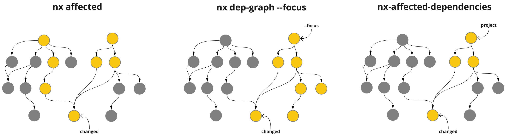

I originally published this blog post with my colleague Patrick Surrey on the <a target="_blank" rel="noreferrer" href="https://engineering.leanix.net/blog/smarter-nx-affected-checks/">LeanIX Engineering Blog</a>.

Each frontend in our nx monorepo has its own workflow for running CI checks and deployment. The default `nx affected` behaviour does not enable us to only get the list of projects that are affected and used by a specific application.

So we wrote a GitHub Action that does just this: [leanix/nx-affected-dependencies-action](https://github.com/leanix/nx-affected-depenencies-action).

[Go to the action repository](https://github.com/leanix/nx-affected-depenencies-action)

[Go to the action on the GitHub Marketplace](https://github.com/marketplace/actions/nx-affected-depencencies-action)

Our main motivation for this action was to speed up the releases of our frontend applications and to save time and money on continuous integration checks.

**The solution:** By combining the [nx affected](https://nx.dev/l/a/cli/affected) and [nx dep-graph --focus=theNameOfTheAppToDeploy](https://nx.dev/l/a/cli/dep-graph) commands we can create an intersection of these two lists to only get the affected projects that are actually a dependency of `theNameOfTheAppToDeploy`.




## How to use it

This is just one way to use the `leanix/nx-affected-dependencies-action` in your workflows. It resembles the use case of merging a feature branch into your `main` branch and comparing the changes of the latest commit on `main` (<code class="language-text" style="white-space: nowrap;">${{ github.sha }}~1</code>) with the merge commit of your feature branch <code class="language-text" style="white-space: nowrap;">(${{ github.sha }}</code>). <br/>For a more detailed overview, including a `gitflow` parameter, please see the project [README](https://github.com/leanix/nx-affected-depenencies-action/blob/main/README.md).

```yaml
- name: Evaluate affected
  uses: leanix/nx-affected-dependencies-action@v0.2.1
  id: affected
  with:
    project: pathfinder
    base: ${{ github.sha }}~1
    head: ${{ github.sha }}

- name: Run Unit Tests (Affected)
  if: steps.affected.outputs.isAffected == 'true'
  env:
    affectedDeps: ${{ steps.affected.outputs.affectedDeps }}
  run: npx nx run-many --target=test --projects=$affectedDeps --runner ci
```

The [nx run-many](https://nx.dev/l/a/cli/run-many) command will run the given `target` task on the provided `projects`, which in this case come from the `affectedDeps` output of the `leanix/nx-affected-dependencies-action`.

## Background

As of the time of writing we are shipping 13 individual angular applications in our nx monorepo. Our CI tool of choice is GitHub Actions.
All our microfrontends will be deployed after a feature branch is merged and CI checks are green.

The most time consuming application in our monorepo is our "shell application". Among "normal shell application things" like the navigation bar it has the largest chunk of code of any application, since it was there long before we started adopting microfrontends.

### How we used to do it

This is a simplified version of the `Test` step in the workflow of a microfrontend when a feature branch is merged:

```yaml
- name: Test
  run: npx nx affected:test --base=${{ github.sha }}~1 --head=${{ github.sha }} --runner ci
```

As you can see we used the [nx affected](https://nx.dev/l/a/cli/affected) command to lint and test the projects affected by the merged changes before deploying the new version of a frontend. However this resulted in each frontend application workflow unnecessarily linting and testing projects that are not used by them, but other applications.

Take a change in our shared component library for example: almost all of our applications will be affected by this. Now our small `todos` microfrontend will redundantly lint and test the large "shell application" and code of other microfrontends, as these are also inside the list of projects returned by `nx affected`.

Our nx cache does save us a significant amount of time spent on GitHub Actions, but the `nx affected` situation definitely wasn't desirable.

## Results

Here is a comparison of the amount of projects to check and their duration for our microfrontends when our shared component library was changed.

**Todos microfrontend:**
`nx affected`: 62 projects in ~12 minutes
`nx-affected-dependencies-action`: 13 projects in ~3 minutes

**Indicators microfrontend:**
`nx affected`: 62 projects in ~12 minutes
`nx-affected-dependencies-action`: 6 projects in ~1 minute

This means the `Todos` release is now completed **9 minutes faster** and `Indicators` **11 minutes faster** than before.