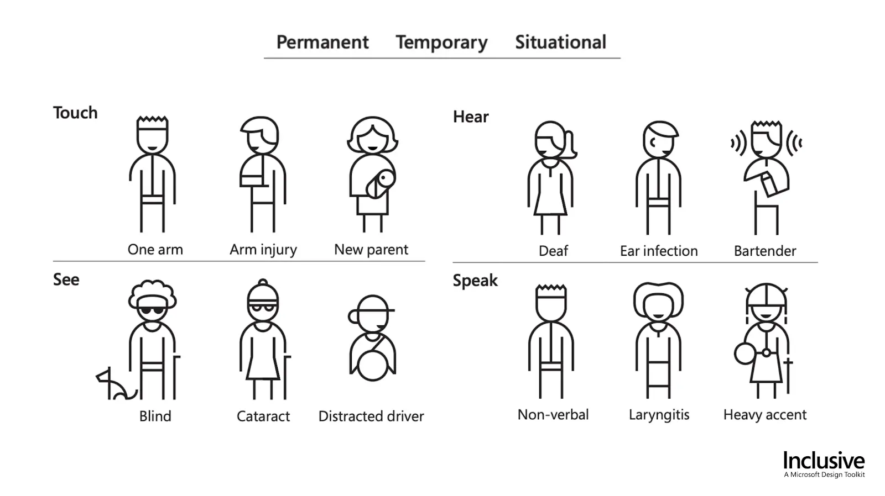

## Preface

I originally published this blog post on the <a target="_blank" rel="noreferrer" href="https://engineering.leanix.net/blog/web-accessibility/">LeanIX Engineering Blog</a>.

I extracted this article from a talk I'm giving to LeanIX employees (and at the [Bonn Code Meetup](/talks/bn-code-webaccessibility/); includes recording). Big thanks to <a target="_blank" rel="noreferrer" href="https://twitter.com/polarbirke">@polarbirke</a> for sparking my interest in web accessibility several years ago and also giving me tips on my talk.

**Disclaimer:** I'm by no means an accessibility expert. I would rather call myself an accessibility nerd. As I prepared my accessibility talk at LeanIX I kept falling deeper into the accessibility rabbit hole and there are still so many things I don't know.

In this post I'm trying to answer the "What, Why, Who, and How" of web accessibility and provide you with the tools to build more accessible web services.

## What is web accessibility?

Short and crisp:

> Web accessibility is about enabling all humans to use web services, regardless of their physical or situational disability.

or as Tim Berners-Lee said:

> The power of the Web is in its universality.
> Access by everyone regardless of disability is an essential aspect.

Source: <a target="_blank" rel="noreferrer" href="https://www.w3.org/standards/webdesign/accessibility">W3C Accessibility</a>

## Why should you care?

First and foremost learning about and building accessible web services makes the web more open to everyone. Secondly, because those "everyone" also includes your paying customers.

### The people (aka our customers)

I used to think of web accessibility mattering only to people with permanent disabilities, but there are plenty of examples where anyone is going to miss accessibility support in web services due to temporary or situational disabilities such as a broken arm as well. Not being able to navigate all features of LeanIX using my left hand and a keyboard is very frustrating in this case.

This graphic from <a target="_blank" rel="noreferrer" href="https://www.microsoft.com/design/inclusive/">Microsoft Inclusive Design</a> presents a small excerpt of people who rely on developers who are mindful of accessibility so that they can use their web services:



On the other hand there's ...

### The law

Here's a list of the laws that I've known the longest/found to be the most influential:

- <a target="_blank" rel="noreferrer" href="https://www.gesetze-im-internet.de/bitv_2_0/BJNR184300011.html">Barrierefreie-Informationstechnik-Verordnung - BITV 2.0</a> public agencies need to conform with this

- <a target="_blank" rel="noreferrer" href="https://www.essentialaccessibility.com/compliance-overview/americans-with-disabilities-act-ada-compliance">Americans with Disabilities Act</a>

- <a target="_blank" rel="noreferrer" href="https://eur-lex.europa.eu/legal-content/EN/TXT/?uri=CELEX%3A32019L0882">European Accessibility Act</a>

- <a target="_blank" rel="noreferrer" href="http://www.gesetze-im-internet.de/bgg/BJNR146800002.html">BGG - Gesetz zur Gleichstellung von Menschen mit Behinderungen</a>

Overview: <a target="_blank" rel="noreferrer" href="https://www.w3.org/WAI/policies/">Web Accessibility Laws and Policies | W3C</a>

By the BITV 2.0 law, for example, any web services that are operated by a public agency in Germany need to be accessible by anyone regardless of their disability.

There've also been several successful court cases in the US about websites of US service providers were not accessible to disabled people, which violates the ADA linked above.

## Who: Meet the WCAG by the W3C

The World Wide Web Consortium (W3C) is the main international standards organization for the World Wide Web founded in 1994 and led by Tim Berners-Lee.

They publish and maintain the Web Content Accessibility Guidelines as part of the Web Accessibility Initiative. If you want to know about web accessibility, I think they should be your first destination online. You can start with their <a href="https://www.w3.org/WAI/fundamentals/accessibility-intro/"  target="_blank" rel="noreferrer">introduction to web accessibility</a> page.

### WCAG POUR principles

The Web Content Accessibility Guidelines (WCAG) are categorized in the following four principles (<a href="https://www.w3.org/WAI/WCAG21/Understanding/intro#understanding-the-four-principles-of-accessibility"  target="_blank" rel="noreferrer">source</a>):

Web content must be...

1. **Perceivable** - Information and user interface components must be presentable to users in ways they can perceive.
   
   This means that users must be able to perceive the information being presented, it can't be invisible to all of their senses.

2. **Operable** - User interface components and navigation must be operable.
   
   This means that users must be able to operate the interface. The interface cannot require interaction that a user cannot perform.

3. **Understandable** - Information and the operation of the user interface must be understandable.
   
   This means that users must be able to understand the information as well as the operation of the user interface. The content or operation cannot be beyond their understanding.

4. **Robust** - Content must be robust enough that it can be interpreted reliably by a wide variety of user agents, including assistive technologies.
   
   This means that users must be able to access the content as technologies advance. As technologies and user agents evolve, the content should remain accessible.

### Disability perspectives

Disability emerges where there is a mismatch between individual capacities and environmental demands<a href="#disability-paper-footnote" id="disability-paper-ref" role="doc-noteref" aria-label="Jump to footnote with source"></a>.

The non-profit organization WebAIM distinguishes the following four categories for permanent disability:

- Visual
  
  Blindness, low vision, color-blindness

- Auditory
  
  Deafness and hard-of-hearing

- Motor
  
  Inability to use a mouse, slow response time, limited fine motor control

- Cognitive
  
  Learning disabilities, distractibility, inability to remember or focus on large amounts of information

Source: <a target="_blank" rel="noreferrer" href="https://webaim.org/intro/">WebAIM: Introduction to Web Accessibility</a>

However as I mentioned before there are many situations where anyone may become reliant on accessible web services, such as a broken arm or wrist or a visually impaired person who just misplaced their glasses.

This video by the W3C is a must-see for me as a non disabled person: <a target="_blank" rel="noreferrer" href="https://www.youtube.com/watch?v=3f31oufqFSM">Web Accessibility Perspectives - Compilation of 10 Topics/Videos</a>

Now that you've read about the Web Content Accessibility guidelines and different kinds of disabilities, let's jump into how to use them to build more accessible web services.

## How?

If you're just starting with paying attention to accessibility in the user interfaces of your services/products, I would suggest starting with one simple rule to adhere to:

> If an action can be done with a mouse, it needs to be doable with a keyboard as well.

A more comprehensive approach that conforms with most laws would be to strive for WCAG conformance level AA.

How do you know what level you're at? **Checklists and Audits.**

### Checklists

Here's my personal "layman web accessibility checklist":

- Every form input needs to have a label that can be associated with this input. Placeholders are no replacement for labels!

- Text should have a minimum contrast ratio of 4.5:1 with its background, strive for at least 7:1. The highest achievable contrast is 21:1 e.g. black on white.

- Provide alternative text for images that convey information.

- Order your heading tags consistently (e.g. don't follow a h2 with an h4 without an h3 in between).

- For keyboard users, the element that currently holds the focus should always be identifiable as such.

- Buttons that visibly only contain icons need to have an alternative text.


And here you can find actual professional accessibility checklists:

- <a href="https://www.a11yproject.com/checklist/" target="_blank" rel="noreferrer">A11Y Project checklist</a>: a well designed and easy to consume checklist

- <a href="https://www.w3.org/WAI/WCAG21/quickref/" target="_blank" rel="noreferrer">WCAG Quickref</a>: a complete list of all rules that allows to filter for different compliance levels relatively easy


### Audits

One important tool to bring attention to accessibility flaws in your services is to pay experts to audit them. I won't recommend any in this post, but there's several highly professional accessibility auditors who are passionate about what they do.

### Use semantic elements aka "A div is not a button"

Using semantic elements is a way to get accessibility out of the box at a low cost.

A few examples:

If something is a list, make it a &lt;ul&gt; or &lt;ol&gt;.

If something is a button, make it a &lt;button&gt; (no &lt;a&gt;, &lt;div&gt;, &lt;span&gt; or whatever tag).

If something is a link, make it an &lt;a&gt; tag (no `window.href=some-url`).

The following HTML code compares the minimal required code to get a `div` element to implement the ARIA `button` role in an Angular component template next to the markup of the native `button` element.

```html
<!-- div button using angular template features --->
<div tabindex="0"
     (click)="onAction()"
     (keydown.enter)="onAction()"
     (keydown.space)="onAction()"
     [style.cursor]="'pointer'"
     role="button"
>Click me</div>

<!-- versus --->

<!-- native button --->
<button (click)="onAction()">Click me</button>
```

Cool resources on this:

- <a href="https://www.buttoncheatsheet.com/" target="_blank" rel="noreferrer">thebuttoncheatsheet.com</a> by <a href="https://twitter.com/mmatuzo" target="_blank" rel="noreferrer">@mmatuzo</a>
- <a href="https://www.scottohara.me/blog/2022/01/20/divisive.html" target="_blank" rel="noreferrer">Div divisiveness</a> by <a href="https://twitter.com/scottohara" target="_blank" rel="noreferrer">@scottohara</a>

### ARIA what?

Aria is especially -  but not exclusively - important for supporting screen readers.

It stands for "Accessible Rich Internet Applications suite of web standards". The Mozilla Developer Network lists some <a href="https://developer.mozilla.org/en-US/docs/Web/Accessibility/ARIA" target="_blank" rel="noreferrer">great resources on learning more about ARIA</a>.

While you can put `tabindex="0"` and event listeners for `click` and `enter` events on a &lt;span&gt; element, this will not enable screen readers to treat this element like a button. To enable this you need to assign your &lt;span&gt; element the ARIA attribute called `role` with the value `button`.

Three things to keep in mind:

1. Semantic elements > ARIA attributes (`button` > `role="button"`).

2. No ARIA is better than bad ARIA.

3. A role is a promise. If you give something an aria role, you should properly implement all input methods that are specified for it.

### On screen readers

A screen reader is a form of assistive technology that renders text and image content as speech or braille output. Since I'm not visually impaired, I've only ever used them for testing. I test with Apple VoiceOver since my developer machine uses Mac OS. You can enable it any time by pressing `cmd + f5`. It's worth it to look into the <a href="https://webaim.org/articles/voiceover/" target="_blank" rel="noreferrer">controls of screen readers</a> before enabling them.

I highly recommend watching this screen reader demonstration video that was recently uploaded on the TetraLogical YouTube channel: <a href="https://www.youtube.com/watch?v=KuVKQQMtRRI&list=PLTqm2yVMMUKVxQ6eYth4_vvbM3IcrSPlk&index=1" target="_blank" rel="noreferrer">Browsing with a desktop screen reader</a>.

One of the directors at TetraLogical is Léonie Watson and she gave a very good talk at the Front-Trends conference in 2015: <a href="youtube.com/watch?v=qdB8SRhqvFc" id="watson-talk" target="_blank" rel="noreferrer">ARIA, Accessibility APIs and coding like you give a damn!</a>

#### Improve how screen readers read your content

Describe interactable elements that do not contain any text that explains what it's doing using the `aria-label` attribute. Also from my research, I'm fairly certain that for targeting screen readers, `aria-label` is more widely supported than `title` attributes.

The following HTML code shows examples for using the `aria-label` and `aria-hidden` attributes including the text that Apple VoiceOver announces when selecting them.

```html
<!-- Reads "button times" -->
<button>&times;</button>

<!-- Reads "button close" -->
<button aria-label="close">&times;</button>

<!-- Reads "button identical to menu" -->
<button>≡ menu</button>

<!-- Reads "button menu" -->
<button><span aria-hidden="true">≡</span> menu</button>
```

To learn more about the `aria-label` attribute I recommend reading <a target="_blank" rel="noreferrer" href="https://dev.opera.com/articles/ux-accessibility-aria-label/">this article on the Opera engineering blog</a>.


### Testing tools

When building accessible web applications, you need to be able to test that your efforts are achieving the desired results.

These are the tools I use for this:

- computer keyboard

- browser plugins

  - <a target="_blank" rel="noreferrer" href="https://chrome.google.com/webstore/detail/axe-devtools-web-accessib/lhdoppojpmngadmnindnejefpokejbdd">axe DevTools</a> (Free version is already very good, Pro license costs 40$ a month per user)

  - <a target="_blank" rel="noreferrer" href="https://accessibilityinsights.io/docs/en/web/overview/">Accessibility Insights for Web</a> by Microsoft

- Apple VoiceOver

Here's a comprehensive list of testing software by the W3C: <a target="_blank" rel="noreferrer" href="https://www.w3.org/WAI/ER/tools/">Web Accessibility Evaluation Tools List</a>

I also recommend taking the time to watch this <a target="_blank" rel="noreferrer" title="Quick accessibility tests" href="https://www.youtube.com/playlist?list=PLTqm2yVMMUKWTr9XWdW5hJ9tk512Ow0SE">great TetraLogical YouTube playlist</a> where they demonstrate common accessibility test cases.

## Summary

The accessibility rabbit hole goes deep and there's so much information on the web about it that takes a lot of time to consume. I hope that with this article I reduced the "fear" of this rabbit hole and maybe even sparked some interest.

And while I know that this might be much to ask next to keeping up with the latest JavaScript frameworks, if there are just three things you'll take away from this article, let it be these:

- web accessibility is cool and helps to make the web more open to anyone

- user interfaces should be designed and built in a way where any user interaction that can be done with a mouse can also be done with a keyboard

- using semantic HTML elements result in less code and better accessibility out of the box

To conclude I'd like to quote a line from Léonie Watson's talk I <a href="#watson-talk">linked above</a>:

> Perfect is the enemy of good.

Don't strive for perfection when building accessible web services. Every little piece can make a difference to your users.

## Resources

<a href="https://www.sciencedirect.com/science/article/pii/S1875067215000863#sect0030" id="disability-paper-footnote" target="_blank" rel="noreferrer">(Dis)ability and the experience of accessibility in the urban environment</a> <a role="doc-backlink" href="#disability-paper-ref" aria-label="Jump to text">↩</a>

I've done a lot of reading to compose this article. In order to not take over your whole viewport with a wall of links, I'm including them in a disclosure widget.

<details>

<summary>Click to show more links to resources regarding accessibility</summary>

- [Accessibility Web Fundamentals Google Developers](https://developers.google.com/web/fundamentals/accessibility)

- [Introduction to Web Accessibility | Web Accessibility Initiative (WAI) | W3C](https://www.w3.org/WAI/fundamentals/accessibility-intro/)

- [Web Content Accessibility Guidelines (WCAG) 2.1](https://www.w3.org/TR/WCAG21/)

- [Microsoft Inclusive Design](https://www.microsoft.com/design/inclusive/)

- [WebAIM](https://webaim.org/)

- [The A11Y Project](https://www.a11yproject.com/)

- [Accessibility at Scale resources - A talk by Eric Bailey](https://gist.github.com/ericwbailey/573045f05b7492f62b32254cc7b07f4d)

- [Inclusive Design Principles](https://inclusivedesignprinciples.org/)

- [Web Accessibility Guide for 2020 | UXPin](https://www.uxpin.com/studio/blog/web-accessibility-guide/)

- [Designing for Web Accessibility – Tips for Getting Started | Web Accessibility Initiative (WAI) | W3C](https://www.w3.org/WAI/tips/designing/)

- [Intro to Accessibility - Front-End Engineering Curriculum - Turing School of Software and Design](https://frontend.turing.edu/lessons/module-2/intro-to-accessibility.html)

- [Accessibility Deep Dive - Front-End Engineering Curriculum - Turing School of Software and Design](https://frontend.turing.edu/lessons/module-3/accessibility-deep-dive.html)

<p class="mt-300 mb-300"><strong>For testing Apple VoiceOver support:</strong></p>

- [WebAIM: Using VoiceOver to Evaluate Web Accessibility](https://webaim.org/articles/voiceover/)

- [Accessibility and Testing with VoiceOver OS (Mac)](https://bbc.github.io/accessibility-news-and-you/accessibility-and-testing-with-voiceover-os.html)

<p class="mt-300 mb-300"><strong>Good resources on ARIA</strong></p>

- [WAI-ARIA Authoring Practices 1.2](https://www.w3.org/TR/wai-aria-practices/) this page includes guides on how to properly implement a long list of UI patterns according to ARIA.

- [WebAIM: Introduction to ARIA - Accessible Rich Internet Applications](https://webaim.org/techniques/aria/)

- [ARIA - Accessibility | MDN](https://developer.mozilla.org/en-US/docs/Web/Accessibility/ARIA)

</details>