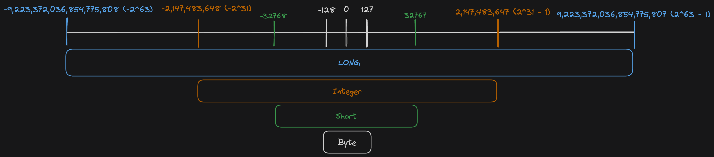

## Introduction

Kotlin has several different data types for numbers. This blog post provides some basic information on how they look like and how they can be used. Additionally it discusses basic concepts which are new in Kotlin.

## Integer

The default types for Integers are signed. This means they have a range from negative to positive values.

1. Byte (8 Bit) from -128 until 127
2. Short (16 Bit) from -32768 until 32767
3. Int (32 Bit) from -2,147,483,648 (-2^31) until 2,147,483,647 (2^31 - 1)
4. Long (64 Bit) from -9,223,372,036,854,775,808 (-2^63) until 9,223,372,036,854,775,807 (2^63 - 1)

If you initialise a variable without an explicit type, the compiler infers the type from the smallest range not exceeding `Int`. If it exceeds `Int` it is a `Long` value. This means that `val myNumber = 1` infers the type `Int` for `myNumber` even though it would fit into a `Byte`or `Short` type. As soon as you have a value bigger than int e.g. `val myNumber = 4000000000` it is with type `Long`.

It is important to understand that in Kotlin every number type is an `Object`. There are no `primitive` types as in Java.
Nevertheless they are compiled into a primitive Java type as long as they are not nullable.
Nullable numbers in Kotlin are compiled into boxed Java Classes representations.

```kotlin
var myInt = 1 // compiled to the primitive integer value
var myInt: Int? = null // compiled to a object wrapped Integer
```

## Float

In contrast to the four different number types for Integer numbers, Kotlin provides two for floating numbers.

1. `Float` 32 Bits -> Significant Bits: 24, Exponent Bits: 8, decimal digits: 6-7
2. `Double`64 Bits -> Signifcant Bits: 53, Exponent Bits: 11, decimal digits: 15-16

```kotlin
println(Float.MIN_VALUE) // 1.4E-45
println(Float.MAX_VALUE) // 3.4028235e38

println(Double.MIN_VALUE) // 4.9E-324
println(Double.MAX_VALUE) // 1.7976931348623157E308
```

The E-Notation explained in short: The `e` stands for "number times ten to the power of ...". So for example it is `3.4028235 times ten to the power of 38`. So you would shift the `.` for `38` positions to the right. In the example this would result in `340 282 350 000 000 000 000 000 000 000 000 000 000`.

Kotlin goes with `double` as the default floating number, if the compiler infers the type.

It is important to know that Kotlin does not have implicit widening or conversion of numbers. 
Every number needs to be explicitly converted to be used with a different number type.

```kotlin
val i = 42
val d = 42.0
val equal = i == d // does not work as Int and Double can not be compared
val equalTwo = i == d.toInt() // would work as double is converted to Int.
```

## Interesting to know

### JVM representation

On the JVM platform numbers are stored in their primitive types. `Int -> int` or `Double -> double`. If you mark a number as nullable `Int?` it will be boxed in the Java Classes `Integer`, `Double` respectively.

### Bit operations

Bit operations e.g. `shl` or `shr` etc. See a full list in the [docs](https://kotlinlang.org/docs/numbers.html#bitwise-operations).

### Float comparison

If the operands are statically known as `Float` or `Double`, the operations follow the [IEE 754 Standard](https://en.wikipedia.org/wiki/IEEE_754).

## Conclusion

The Kotlin implementation for numbers is convenient to use, but in details complex. I tried to come up with an overview image of the different ranges of existing number types.


